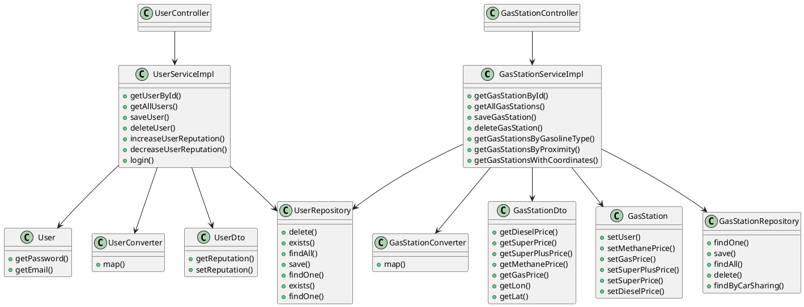

# Integration and API Test Documentation

Authors:

Date:

Version:

# Contents

- [Dependency graph](#dependency graph)

- [Integration and API Test Documentation](#integration-and-api-test-documentation)
- [Contents](#contents)
- [Dependency graph](#dependency-graph)
- [Integration approach](#integration-approach)
- [Tests](#tests)
  - [Step 1 - Unit test of leaf classes](#step-1---unit-test-of-leaf-classes)
  - [Step 2](#step-2)
  - [Step n API Tests](#step-n-api-tests)
- [Scenarios](#scenarios)
  - [Scenario UCx.y](#scenario-ucxy)
- [Coverage of Scenarios and FR](#coverage-of-scenarios-and-fr)
- [Coverage of Non Functional Requirements](#coverage-of-non-functional-requirements)
    - 

- [Tests](#tests)

- [Scenarios](#scenarios)

- [Coverage of scenarios and FR](#scenario-coverage)
- [Coverage of non-functional requirements](#nfr-coverage)

# Dependency graph 

     
# Integration approach

Integration test are performed using bottom up approach.  
Step1: User, UserDto, UserRepository, UserConverter, GasStation, GasStationDto, GasStationRepository, GasStationConverter 
Step2: UserServiceImpl + UserConverter, UserServiceImpl + User,UserServiceImpl + User+ UserRepository,UserServiceImpl + User+ IdPw, GasStationServiceImpl + GasStationConverter, GasStationServiceImpl + GasStation, GasStationServiceImpl + GasStation + GasStationRepository  

    <Write here the integration sequence you adopted, in general terms (top down, bottom up, mixed) and as sequence
    (ex: step1: class A, step 2: class A+B, step 3: class A+B+C, etc)> 
    <The last integration step corresponds to API testing at level of Service package>
    <Tests at level of Controller package will be done later>

#  Tests

   <define below a table for each integration step. For each integration step report the group of classes under test, and the names of
     JUnit test cases applied to them>

## Step 1 - Unit test of leaf classes
| Classes  | JUnit test cases |
|--|--|
|UserRepository|testUserRepository1_1()|
||testUserRepository1_2()|
||testUserRepository1_3()|
||testUserRepository1_4()|
|UserDto| See Unit Test cases for UserDto|
|User| See Unit Test cases for User|
|IdPw| See Unit Test cases for IdPw|
UserConverter|testUserConverter1_1()|
||testUserConverter1_2()|
|GasStation| See Unit Test cases for GasStation|
|GasStationDto| See Unit Test cases for GasStationDto|
|GasStationRepository|testGasStationRepository1_1()|
||testGasStationRepository1_2()|
||testGasStationRepository1_3()|
||testGasStationRepository1_4()|
|GasStationConverter| testGasStationConverter1_1()|
||testGasStationConverter1_2()|

## Step 2
| Classes  | JUnit test cases |
|--|--|
|UserServiceImpl + User |testIntegration1_1()|
||testIntegration1_2()|
||testIntegration1_3()|
||testIntegration1_4()|
|UserServiceImpl + UserConverter |testIntegration1_1()|
||testIntegration1_2()|
||testIntegration1_3()|
||testIntegration1_4()|
|UserServiceImpl + User+ UserRepository |testIntegration1_5()|
||testIntegration1_6()|
|UserServiceImpl + User+ IdPw |testIntegration1_7()|
|GasStationServiceImpl + GasStation + GasStationRepository + GasStationConverter |testIntegration1_8()|

## Step n API Tests

   <The last integration step  should correspond to API testing, or tests applied to all classes implementing the APIs defined in the Service package>

| Classes  | JUnit test cases |
|--|--|
|||

# Scenarios

<If needed, define here additional scenarios for the application. Scenarios should be named
 referring the UC they detail>

## Scenario UC1

| Scenario |  Create a user account |
| ------------- |:-------------:| 
|  Precondition     |User U does not exist and needs credentials|
|  Post condition     |  User U added in the system  and successfully login|
| Step#        | Description  |
|  1     |  U selects Signup |  
|  2     |  U fills al the form fields for a new account U |
| 3 | U submits data inserted |
| 4 | Account U added in the system|
| 5 | Account U login in the system|

## Scenario UC2

| Scenario |  Create a user account |
| ------------- |:-------------:| 
|  Precondition     |User U exists with reputation N|
|  Post condition     | Reputation of User U is increased  N=N+1|
| Step#        | Description  |
|  1     |  U logins |  
|  2     |  U signals for right price |
| 3 | Reputation of User U is increase by 1 |

## Scenario UC3

<!-- Is it possible in the application now?? -->

| Scenario |  Delete user account |
| ------------- |:-------------:| 
|  Precondition     |Account U exists  |
|  Post condition     |  Account U deleted from the system by Admin A |
| Step#        | Description  |
|  1     |  A logins in application |  
|  2     |  A loads admin page |
|  3     |  A deletes U using by pressing delete button |

# Coverage of Scenarios and FR

<Report in the following table the coverage of  scenarios (from official requirements and from above) vs FR. 
Report also for each of the scenarios the (one or more) API JUnit tests that cover it. >

| Scenario ID | Functional Requirements covered | JUnit  Test(s) | 
| ----------- | ------------------------------- | ----------- | 
|  ..         | FRx                             |             |             
|  ..         | FRy                             |             |             
| ...         |                                 |             |             
| ...         |                                 |             |             
| ...         |                                 |             |             
| ...         |                                 |             |             

# Coverage of Non Functional Requirements

<Report in the following table the coverage of the Non Functional Requirements of the application - only those that can be tested with automated testing frameworks.>

### 

| Non Functional Requirement | Test name |
| -------------------------- | --------- |
|                            |           |

