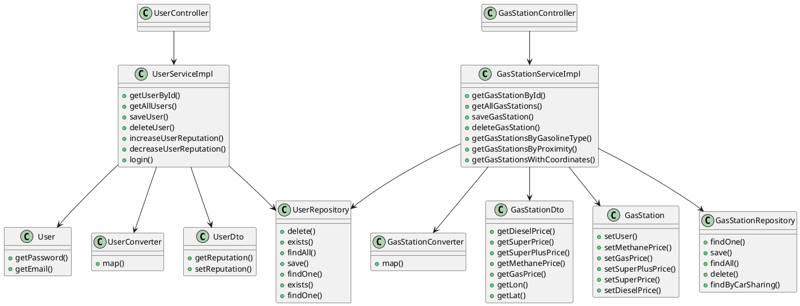

# Integration and API Test Documentation

Authors:

Date:

Version:

# Contents

- [Dependency graph](#dependency graph)

- [Integration and API Test Documentation](#integration-and-api-test-documentation)
- [Contents](#contents)
- [Dependency graph](#dependency-graph)
- [Integration approach](#integration-approach)
- [Tests](#tests)
  - [Step 1 - Unit test of leaf classes](#step-1---unit-test-of-leaf-classes)
  - [Step 2](#step-2)
- [Scenarios](#scenarios)
  - [Scenario UC1.1](#scenario-uc11)
  - [Scenario UC3.1](#scenario-uc31)
  - [Scenario UC4.1](#scenario-uc41)
  - [Scenario UC5.1](#scenario-uc51)
  - [Scenario UC6.1](#scenario-uc61)
  - [Scenario UC7.1](#scenario-uc71)
  - [Scenario UC8.1](#scenario-uc81)
  - [Scenario UC10.1](#scenario-uc101)
- [Coverage of Scenarios and FR](#coverage-of-scenarios-and-fr)
- [Coverage of Non Functional Requirements](#coverage-of-non-functional-requirements)
    - 

- [Tests](#tests)

- [Scenarios](#scenarios)

- [Coverage of scenarios and FR](#scenario-coverage)
- [Coverage of non-functional requirements](#nfr-coverage)

# Dependency graph 

     
# Integration approach

Integration test are performed using bottom up approach.  
Step1: User, UserDto, UserRepository, UserConverter, GasStation, GasStationDto, GasStationRepository, GasStationConverter 
Step2: UserServiceImpl + UserConverter, UserServiceImpl + User,UserServiceImpl + User+ UserRepository,UserServiceImpl + User+ IdPw, GasStationServiceImpl + GasStationConverter, GasStationServiceImpl + GasStation, GasStationServiceImpl + GasStation + GasStationRepository  

  

#  Tests

   

## Step 1 - Unit test of leaf classes
| Classes  | JUnit test cases |
|--|--|
|UserRepository|testUserRepository1_1()|
||testUserRepository1_2()|
||testUserRepository1_3()|
||testUserRepository1_4()|
|UserDto| See Unit Test cases for UserDto|
|User| See Unit Test cases for User|
|IdPw| See Unit Test cases for IdPw|
UserConverter|testUserConverter1_1()|
||testUserConverter1_2()|
|GasStation| See Unit Test cases for GasStation|
|GasStationDto| See Unit Test cases for GasStationDto|
|GasStationRepository|testGasStationRepository1_1()|
||testGasStationRepository1_2()|
||testGasStationRepository1_3()|
||testGasStationRepository1_4()|
|GasStationConverter| testGasStationConverter1_1()|
||testGasStationConverter1_2()|

## Step 2
| Classes  | JUnit test cases |
|--|--|
|UserServiceImpl + User |testIntegration1_1()|
||testIntegration1_2()|
||testIntegration1_3()|
||testIntegration1_4()|
|UserServiceImpl + UserConverter |testIntegration1_1()|
||testIntegration1_2()|
||testIntegration1_3()|
||testIntegration1_4()|
|UserServiceImpl + User+ UserRepository |testIntegration1_5()|
||testIntegration1_6()|
|UserServiceImpl + User+ IdPw |testIntegration1_7()|
|GasStationServiceImpl + GasStation + GasStationRepository + GasStationConverter |testIntegration1_8()|

# Scenarios

## Scenario UC1.1

| Scenario |  Create a user account |
| ------------- |:-------------:| 
|  Precondition     |User U does not exist and needs credentials|
|  Post condition     |  User U added in the system  and successfully login|
| Step#        | Description  |
|  1     |  U selects Signup |  
|  2     |  U fills al the form fields for a new account U |
| 3 | U submits data inserted |
| 4 | Account U added in the system|
| 5 | Account U login in the system|

## Scenario UC2.1

| Scenario |  Modify a user account |
| ------------- |:-------------:| 
|  Precondition     |User U exists and it's informations must be updated|
|  Post condition     |  User U informations are modified and saved in the system|
| Step#        | Description  |
|  1     |  U wants to modify it's account |  
|  2     |  U submits new email and username |
| 3 | The changes are saved in the system |

## Scenario UC3.1

| Scenario |  Delete user account |
| ------------- |:-------------:| 
|  Precondition     |Account U exists|
|  Post condition     |  Account U deleted from the system|
| Step#        | Description  |
|  1     |  U selects Login |  
|  2     |  U fills al the form fields and access the User management page |
| 3 | U requires to delete his account |
| 4 | Account U is deleted from the system|

## Scenario UC4.1

| Scenario |  Create Gas Station |
| ------------- |:-------------:| 
|  Precondition     | Gas Station G does not exist  |
|  Post condition     |  Gas Station G is created by Admin A |
| Step#        | Description  |
|  1     |  A logins in application |  
|  2     |  A loads admin page |
|  3     |  A enters all fields for a new G |  
|  4     |  A submits data inserted |
|  5     |  G added in the system|

## Scenario UC5.1

| Scenario |  Modify Gas Station information |
| ------------- |:-------------:| 
|  Precondition     | Gas Station G exists  |
|  Post condition     | - |
| Step#        | Description  |
|  1     |  Admin A logins in application |  
|  2     |  A loads admin page |
|  3     |  A selects edit from the row of G |  
|  4     |  A modifies fields of G |  
|  5     |  A submits data inserted |
|  6     |  G updated|

## Scenario UC6.1

| Scenario |  Delete Gas Station |
| ------------- |:-------------:| 
|  Precondition     |Gas Station G exists  |
|  Post condition     |  Gas Station G is deleted from system by Admin A |
| Step#        | Description  |
|  1     |  A logins in application |  
|  2     |  A loads admin page |
|  3     |  A selects remove from the row of G |  
|  4     |  G deleted |

## Scenario UC7.1

| Scenario |  Report fuel price for a gas station |
| ------------- |:-------------:| 
|  Precondition     | Gas Station G exists  |
| | User U is registered in the system |
| | G has no attached price list |
|  Post condition     | Price list P is created |
| | P.time_tag is set to the current timestamp of the system |
| | P is attached to G |
| | U is attached to P (needed later to update trust level of U) |
| Step#        | Description  |
|  1     |  U logins in application |  
|  2     |  U selects G for which he/she wants to insert a price report |
|  3     | The system prompts U with the list of possible fuels provided by G |  
|  4     |  U inserts the prices for the fuels |
|  5     |  U submits data |

## Scenario UC8.1

| Scenario |  Obtain price of fuel for Gas Stations in a certain geographic area |
| ------------- |:-------------:| 
|  Precondition     | - |
|  Post condition     | - |
| Step#        | Description  |
|  1     |  Anonymous User AU selects a geo point GP and a radius r |  
|  2     |  The system prompts all gas stations within r from GP, with their prices for all available fuels. If a price for a fuel is missing "NA" is reported. The system shows also, for each gas station, the trust level of the prices |

## Scenario UC10.1

| Scenario | Price is correct |
| ------------- |:-------------:| 
|  Precondition     | User U exists and has valid account |
| | Gas Station G exists and has price list inserted by U2 |
|  Post condition     | U2.trust_level++  |
| Step#        | Description  |
|  1     |  U selects gas station G|  
|  2     |  U signals price for G is correct|

# Coverage of Scenarios and FR

<Report in the following table the coverage of  scenarios (from official requirements and from above) vs FR. 
Report also for each of the scenarios the (one or more) API JUnit tests that cover it. >

| Scenario ID | Functional Requirements covered | JUnit  Test(s) | 
| ----------- | ------------------------------- | ----------- | 
| UC1.1       | FR1.1                           |testIntegration1_1()|             
|             |                                 |testIntegration1_7()|     
| UC2.1       | FR1.1                           |testUserDto1_4()|             
|             |                                 |testLoginDto1_4()|         
| UC3.1       | FR1.2                           |testIntegration1_2()|                                 
| UC4.1       | FR3.1                           |testIntegration1_8()|             
| UC5.1       | FR3.1                           ||           
|             | FR3.3                           ||               
| UC6.1       | FR3.2                           ||            
|             | FR3.3                           ||              
| UC7.1       | FR5.1                           ||   
| UC8.1       | FR4.1                           ||     
| UC10.1      | FR5.2                           |testIntegration1_5()|  
|             |                                 |testIntegration1_6()|            
|             |                                 ||  
| ...         |                                 |             |             

# Coverage of Non Functional Requirements

<Report in the following table the coverage of the Non Functional Requirements of the application - only those that can be tested with automated testing frameworks.>

### 

| Non Functional Requirement | Test name |
| -------------------------- | --------- |
|                            |           |

