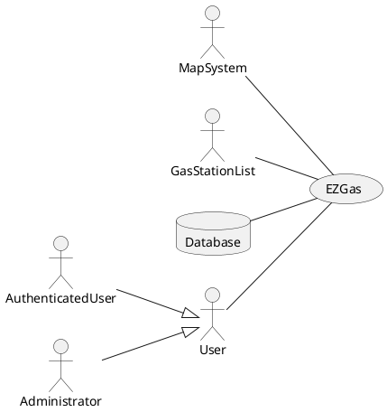

# Requirements Document 

Authors:

Date:

Version:

# Contents

- [Stakeholders](#stakeholders)
- [Context Diagram and interfaces](#context-diagram-and-interfaces)
	+ [Context Diagram](#context-diagram)
	+ [Interfaces](#interfaces) 
	
- [Requirements Document](#requirements-document)
- [Contents](#contents)
- [Stakeholders](#stakeholders)
- [Context Diagram and interfaces](#context-diagram-and-interfaces)
	- [Context Diagram](#context-diagram)
	- [Interfaces](#interfaces)
- [Stories and personas](#stories-and-personas)
- [Functional and non functional requirements](#functional-and-non-functional-requirements)
	- [Functional Requirements](#functional-requirements)
	- [Non Functional Requirements](#non-functional-requirements)
- [Use case diagram and use cases](#use-case-diagram-and-use-cases)
	- [Use case diagram](#use-case-diagram)
		- [Use case 1, UC1](#use-case-1-uc1)
				- [Scenario 1.1](#scenario-11)
				- [Scenario 1.2](#scenario-12)
		- [Use case 2, UC2](#use-case-2-uc2)
		- [Use case](#use-case)
- [Glossary](#glossary)
- [System Design](#system-design)
- [Deployment Diagram](#deployment-diagram)


# Stakeholders


| Stakeholder name  | Description | 
| ----------------- |:-----------|
|         User          |He’s interested in searching for the nearest gas station or the cheapest one.| 
|  Authenticated user   |He has the same interests as User and can, additionally, modify Gas Station information. | 
|	Administrator       |He’s interested in monitoring how the users use the app if they behave correctly and manage account settings.| 
|		Developer		|He’s interested in producing a well working and appealing application.| 
|		Map System		|It provides an explorable and well design map on which Gas Stations are shown which is obtained from (www.openstreetmap.org).| 
|		Database		|It offers a storage solution for managing account and Gas Station details. | 
|	Gas Stations' list	|This is a free document obtained from (www.datiopen.it) which contains a starting point for the Gas Station list that EZGas will provide to the user.| 

# Context Diagram and interfaces

## Context Diagram


## Interfaces
```diff
! TODO to be checked
```

| Actor | Logical Interface | Physical Interface  |
| ------------- |:-------------:| :-----:|
|User |GUI |Screen, keyboard, touchscreen |
|Authenticated user |GUI |Screen, keyboard, touchscreen |
|Administrator |GUI |Screen, keyboard, touchscreen |
|Database |API |Internet |
|Map System |API |Internet |
|Gas Station List |XML |Internet |

# Stories and personas

• Persona 1: middle age, middle-high income, professional<br>
• Emily travels every day for a lot of time going and returning from work. She wants to get home early to spend more time with her family, so she uses EZGas to quickly find the nearest gas station.
 <br><br>
• Persona 2: young, low income, student <br>
 • John lives in the town near to his university and each day he has to travel in his car to attend the lessons. Since he has little income he would like to save on fuel, which is a considerable expense, so John uses EZGas to find the best fuel price from gas stations along the way to university.


# Functional and non functional requirements

## Functional Requirements

| ID        | Description  |
| ------------- |:-------------| 
|  FR1	   | User registration |
|  FR2     | Sign in |  
|  FR3    | Show the gas station list.|
|   &nbsp;&nbsp;&nbsp;&nbsp;&nbsp;&nbsp;FR3.1     | Locate for type of fuel|
|  &nbsp;&nbsp;&nbsp;&nbsp;&nbsp;&nbsp; FR3.2     | Locate for price|
|  &nbsp;&nbsp;&nbsp;&nbsp;&nbsp;&nbsp; FR3.3     | Locate for distance|
|  &nbsp;&nbsp;&nbsp;&nbsp;&nbsp;&nbsp; FR3.4     | Locate by name|
|     FR4	   | Handle Gas Station item |
|  &nbsp;&nbsp;&nbsp;&nbsp;&nbsp;&nbsp; FR4.1      | Select and Display gas station details.|
|  &nbsp;&nbsp;&nbsp;&nbsp;&nbsp;&nbsp;  FR4.2    | Show selected gas station on the map.|
|  FR5	       | Handle Gas Station information |
|  &nbsp;&nbsp;&nbsp;&nbsp;&nbsp;&nbsp; FR5.1     | Update the price of fuels in a gas station |
|  &nbsp;&nbsp;&nbsp;&nbsp;&nbsp;&nbsp; FR5.2     | Update the state of the gas station (open, closed) |
|  &nbsp;&nbsp;&nbsp;&nbsp;&nbsp;&nbsp; FR5.3     | Add a new gas station |
|  &nbsp;&nbsp;&nbsp;&nbsp;&nbsp;&nbsp; FR5.4     | Remove a gas station |
|  FR6	       | Handle user |
|  &nbsp;&nbsp;&nbsp;&nbsp;&nbsp;&nbsp; FR6.1	   | Delete user |
|  &nbsp;&nbsp;&nbsp;&nbsp;&nbsp;&nbsp; FR6.2	   | Manage closed Gas Station reports  |
| FR7		   | Handle map |
| &nbsp;&nbsp;&nbsp;&nbsp;&nbsp;&nbsp;FR7.1	   | Center map |
| &nbsp;&nbsp;&nbsp;&nbsp;&nbsp;&nbsp; FR7.2	   | Resize map |

## Non Functional Requirements

| ID        | Type (efficiency, reliability, .. see iso 9126)           | Description  | Refers to |
| ------------- |:----------:| :---------------| :-----:|
|  NFR1     | Efficiency | All the function completed in less than 0.5 second.  | All FR |
|  NFR2     | External | If the software is used in Europe, it has to treat personal data according to the current privacy laws (see: GDRP).  | All FR |
|  NFR3     | Portability | The application runs on recent Android(v. 5) and iOS (v.11) devices.  | All FR |
|  NFR4     | Portability | The application runs on all recent browsers(Safari v.10, Chrome v.68, Firefox v.60).  | All FR |
|  NFR5     | Safety | The application should advertise the user to not use the application while driving.  | All FR |
|  NFR6     | Localisation | Decimal numbers use . (dot) as decimal separator | All FR |
|  NFR7		| Reliability | Shown data are referred to the last confirmed update| All FR |
|  NFR8	    | Functionality | Currencies are changed basing on the country. | All FR |


# Use case diagram and use cases


## Use case diagram
\<define here UML Use case diagram UCD summarizing all use cases, and their relationships>


\<next describe here each use case in the UCD>
### Use case 1, UC1
| Actors Involved        |  |
| ------------- |:-------------:| 
|  Precondition     | \<Boolean expression, must evaluate to true before the UC can start> |  
|  Post condition     | \<Boolean expression, must evaluate to true after UC is finished> |
|  Nominal Scenario     | \<Textual description of actions executed by the UC> |
|  Variants     | \<other executions, ex in case of errors> |

##### Scenario 1.1 

\<describe here scenarios instances of UC1>

\<a scenario is a sequence of steps that corresponds to a particular execution of one use case>

\<a scenario is a more formal description of a story>

\<only relevant scenarios should be described>

| Scenario 1.1 | |
| ------------- |:-------------:| 
|  Precondition     | \<Boolean expression, must evaluate to true before the scenario can start> |
|  Post condition     | \<Boolean expression, must evaluate to true after scenario is finished> |
| Step#        | Description  |
|  1     |  |  
|  2     |  |
|  ...     |  |

##### Scenario 1.2

### Use case 2, UC2
..

### Use case
..


# Glossary

\<use UML class diagram to define important concepts in the domain of the system, and their relationships> 

\<concepts are used consistently all over the document, ex in use cases, requirements etc>

# System Design
\<describe here system design>

\<must be consistent with Context diagram>

# Deployment Diagram 

\<describe here deployment diagram >
