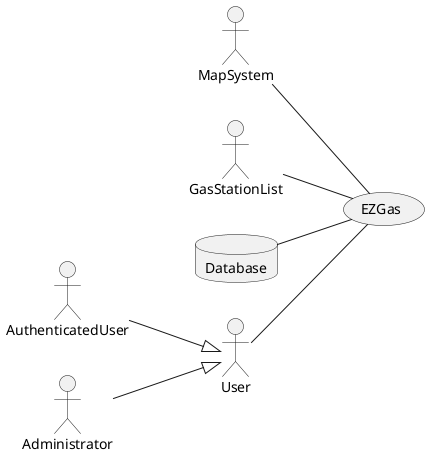

# Requirements Document 

Authors:

Date:

Version:

# Contents

- [Stakeholders](#stakeholders)
- [Context Diagram and interfaces](#context-diagram-and-interfaces)
	+ [Context Diagram](#context-diagram)
	+ [Interfaces](#interfaces) 
	
- [Requirements Document](#requirements-document)
- [Contents](#contents)
- [Stakeholders](#stakeholders)
- [Context Diagram and interfaces](#context-diagram-and-interfaces)
	- [Context Diagram](#context-diagram)
	- [Interfaces](#interfaces)
- [Stories and personas](#stories-and-personas)
- [Functional and non functional requirements](#functional-and-non-functional-requirements)
	- [Functional Requirements](#functional-requirements)
	- [Non Functional Requirements](#non-functional-requirements)
- [Use case diagram and use cases](#use-case-diagram-and-use-cases)
	- [Use case diagram](#use-case-diagram)
		- [Use case 1, UC1 - Handle user account](#use-case-1-uc1---handle-user-account)
				- [Scenario 1.1](#scenario-11)
				- [Scenario 1.2](#scenario-12)
		- [Use case](#use-case)
- [Glossary](#glossary)
- [System Design](#system-design)
- [Deployment Diagram](#deployment-diagram)


# Stakeholders


| Stakeholder name  | Description | 
| ----------------- |:-----------|
|         User          |He’s interested in searching for the nearest gas station or the cheapest one.| 
|  Authenticated user   |He has the same interests as User and can, additionally, modify Gas Station information. | 
|	Administrator       |He’s interested in monitoring how the users use the app if they behave correctly and manage account settings.| 
|		Developer		|He’s interested in producing a well working and appealing application.| 
|		Map System		|It provides an explorable and well design map on which Gas Stations are shown which is obtained from (www.openstreetmap.org).| 
|		Database		|It offers a storage solution for managing account and Gas Station details. | 
|	Gas Stations' list	|This is a free document obtained from (www.datiopen.it) which contains a starting point for the Gas Station list that EZGas will provide to the user.| 

# Context Diagram and interfaces

## Context Diagram


## Interfaces
```diff
! TODO to be checked
```

| Actor | Logical Interface | Physical Interface  |
| ------------- |:-------------:| :-----:|
|User |GUI |Screen, keyboard, touchscreen |
|Authenticated user |GUI |Screen, keyboard, touchscreen |
|Administrator |GUI |Screen, keyboard, touchscreen |
|Database |API |Internet |
|Map System |API |Internet |
|Gas Station List |XML |Internet |

# Stories and personas

• Persona 1: middle age, middle-high income, professional<br>
• Emily travels every day for a lot of time going and returning from work. She wants to get home early to spend more time with her family, so she uses EZGas to quickly find the nearest gas station.
 <br><br>
• Persona 2: young, low income, student <br>
 • John lives in the town near to his university and each day he has to travel in his car to attend the lessons. Since he has little income he would like to save on fuel, which is a considerable expense, so John uses EZGas to find the best fuel price from gas stations along the way to university.


# Functional and non functional requirements

## Functional Requirements

| ID        | Description  |
| ------------- |:-------------| 
|  FR1     | Handle user account  |  
|  &nbsp;&nbsp;&nbsp;&nbsp;&nbsp;&nbsp;FR1.1	   | Account creation |
|  &nbsp;&nbsp;&nbsp;&nbsp;&nbsp;&nbsp;FR1.2    | Log in|  
|  FR2    | Show the gas station list.|
|   &nbsp;&nbsp;&nbsp;&nbsp;&nbsp;&nbsp;FR2.1     | Locate for type of fuel|
|  &nbsp;&nbsp;&nbsp;&nbsp;&nbsp;&nbsp; FR2.2     | Locate for price|
|  &nbsp;&nbsp;&nbsp;&nbsp;&nbsp;&nbsp; FR2.3     | Locate for distance|
|  &nbsp;&nbsp;&nbsp;&nbsp;&nbsp;&nbsp; FR2.4     | Locate by name|
|     FR3	   | Handle Gas Station item |
|  &nbsp;&nbsp;&nbsp;&nbsp;&nbsp;&nbsp; FR3.1      | Select and Display gas station details.|
|  &nbsp;&nbsp;&nbsp;&nbsp;&nbsp;&nbsp;  FR3.2    | Show selected gas station on the map.|
|  FR4	       | Handle Gas Station information |
|  &nbsp;&nbsp;&nbsp;&nbsp;&nbsp;&nbsp; FR4.1     | Update the price of fuels in a gas station |
|  &nbsp;&nbsp;&nbsp;&nbsp;&nbsp;&nbsp; FR4.2     | Update the state of the gas station (open, closed) |
|  &nbsp;&nbsp;&nbsp;&nbsp;&nbsp;&nbsp; FR4.3     | Add a new gas station |
|  &nbsp;&nbsp;&nbsp;&nbsp;&nbsp;&nbsp; FR4.4     | Remove a gas station |
|  FR5	       | Handle user |
|  &nbsp;&nbsp;&nbsp;&nbsp;&nbsp;&nbsp; FR5.1	   | Delete user |
|  &nbsp;&nbsp;&nbsp;&nbsp;&nbsp;&nbsp; FR5.2	   | Manage closed Gas Station reports  |
| FR6		   | Handle map |
| &nbsp;&nbsp;&nbsp;&nbsp;&nbsp;&nbsp;FR6.1	   | Center map |
| &nbsp;&nbsp;&nbsp;&nbsp;&nbsp;&nbsp; FR6.2	   | Resize map |

## Non Functional Requirements


| ID        | Type (efficiency, reliability, .. see iso 9126)           | Description  | Refers to |
| ------------- |:----------:| :---------------| :-----:|
|  NFR1     | Efficiency | All the function completed in less than 0.5 second.  | All FR |
|  NFR2     | External | If the software is used in Europe, it has to treat personal data according to the current privacy laws (see: GDRP).  | All FR |
|  NFR3     | Portability | The application runs on recent Android(v.5 on) and iOS (v.11 on) devices.  | All FR |
|  NFR4     | Portability | The application runs on the following recent browsers(Safari v.10 on, Chrome v.68 on, Firefox v.60 on).  | All FR |
|  NFR5     | Safety | The application should advertise the user to not use the application while driving.  | All FR |
|  NFR6     | Localisation | Decimal numbers use . (dot) as decimal separator | FR2, FR3, FR4 |
|  NFR7		| Reliability | Shown data are referred to the last confirmed update| FR2, FR3 |
|  NFR8	    | Functionality | Currencies are changed basing on the country. | FR2, FR3, FR4, FR6 |
|  NFR9	    | Functionality | English and Italian languages are supported. | All FR |


# Use case diagram and use cases


## Use case diagram

### Use case 1, UC1 - Handle user account
| Actors Involved        | User |
| ------------- |:-------------| 
|  Precondition     |  - |  
|  Post condition     | Account created or login performed. |
|  Nominal Scenario     | User wants to create a new account or log in in his account in order to interact in a better way with the application (contribute to add or remove Gas Station, update Gas Station prices and current state). |
|  Variants     | User could desire to use the application without an account|

##### Scenario 1.1 


| Scenario 1.1 |  Account creation|
| ------------- |:-------------| 
|  Precondition     | - |
|  Post condition     | Account created succesfully. |
| Step#        | Description  |
|  1     | Application is launched|  
|  2	 |User access Account Management page|
|  3     | Personal information is asked|
|  4     | Once, provided, personal information is stored in database|
|  5     | User can perform the log in|


##### Scenario 1.2

| Scenario 1.2|  Log in|
| ------------- |:-------------| 
|  Precondition     | Account exists|
|  Post condition     | User succesfully logged in |
| Step#        | Description  |
|  1     | Application is launched|  
|  2	 |User access Account Management page|
|  3     | Username and password are provided|
|  4     | Application checks if this data is correct|
|  5     | User accesses the main application functionalities.|


### Use case
..


# Glossary

\<use UML class diagram to define important concepts in the domain of the system, and their relationships> 

\<concepts are used consistently all over the document, ex in use cases, requirements etc>

# System Design
\<describe here system design>

\<must be consistent with Context diagram>

# Deployment Diagram 

\<describe here deployment diagram >
