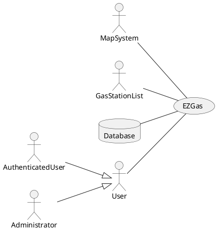
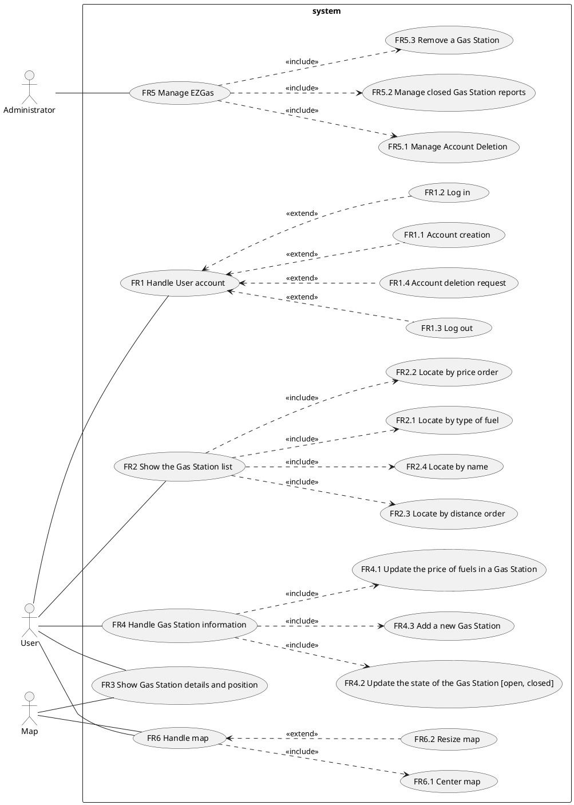

# Requirements Document 

Authors:

Date:

Version:

# Contents

- [Stakeholders](#stakeholders)
- [Context Diagram and interfaces](#context-diagram-and-interfaces)
	+ [Context Diagram](#context-diagram)
	+ [Interfaces](#interfaces) 
	
- [Requirements Document](#requirements-document)
- [Contents](#contents)
- [Stakeholders](#stakeholders)
- [Context Diagram and interfaces](#context-diagram-and-interfaces)
	- [Context Diagram](#context-diagram)
	- [Interfaces](#interfaces)
- [Stories and personas](#stories-and-personas)
- [Functional and non functional requirements](#functional-and-non-functional-requirements)
	- [Functional Requirements](#functional-requirements)
	- [Non Functional Requirements](#non-functional-requirements)
- [Use case diagram and use cases](#use-case-diagram-and-use-cases)
	- [Use case diagram](#use-case-diagram)
		- [Use case 1, UC1 - FR1 Handle user account](#use-case-1-uc1---fr1-handle-user-account)
				- [Scenario 1.1](#scenario-11)
				- [Scenario 1.2](#scenario-12)
		- [Use case 2, UC2 - FR2 Show the gas station list](#use-case-2-uc2---fr2-show-the-gas-station-list)
				- [Scenario 2.1](#scenario-21)
				- [Scenario 2.2](#scenario-22)
		- [Use case 3, UC3 - FR3 Handle gas station item and center the map on the gas station position](#use-case-3-uc3---fr3-handle-gas-station-item-and-center-the-map-on-the-gas-station-position)
				- [Scenario 3.1](#scenario-31)
		- [Use case 4, UC4 - FR4 Handle Gas Station information](#use-case-4-uc4---fr4-handle-gas-station-information)
				- [Scenario 4.1](#scenario-41)
				- [Scenario 4.2](#scenario-42)
				- [Scenario 4.3](#scenario-43)
		- [Use case 5, UC5 - FR5 Manage EZGas](#use-case-5-uc5---fr5-manage-ezgas)
				- [Scenario 5.1](#scenario-51)
		- [Use case 6, UC6 - FR6 Handle map](#use-case-6-uc6---fr6-handle-map)
				- [Scenario 6.1](#scenario-61)
- [Glossary](#glossary)
- [System Design](#system-design)
- [Deployment Diagram](#deployment-diagram)


# Stakeholders


| Stakeholder name  | Description | 
| ----------------- |:-----------|
|         User          |He’s interested in searching for the nearest gas station or the cheapest one.| 
|  Authenticated user   |He has the same interests as User and can, additionally, modify Gas Station information. | 
|	Administrator       |He’s interested in monitoring how the users use the app if they behave correctly and manage account settings.| 
|		Developer		|He’s interested in producing a well working and appealing EZGas application.| 
|		Map System		|It provides an explorable and well design map on which Gas Stations are shown which is obtained from (www.openstreetmap.org).| 
|		Database		|It offers a storage solution for managing account and Gas Station details. | 
|	Gas Stations' list	|This is a free document obtained from (www.datiopen.it) which contains a starting point for the Gas Station list that EZGas will provide to the user.| 

# Context Diagram and interfaces

## Context Diagram


## Interfaces
```diff
! TODO to be checked
```

| Actor | Logical Interface | Physical Interface  |
| ------------- |:-------------:| :-----:|
|User |GUI |Screen, keyboard, touchscreen |
|Authenticated user |GUI |Screen, keyboard, touchscreen |
|Administrator |GUI |Screen, keyboard, touchscreen |
|Database |API |Internet |
|Map System |API |Internet |
|Gas Station List |XML |Internet |

# Stories and personas

• Persona 1: middle age, middle-high income, professional<br>
• Emily travels every day for a lot of time going and returning from work. She wants to get home early to spend more time with her family, so she uses EZGas to quickly find the nearest gas station.
 <br><br>
• Persona 2: young, low income, student <br>
 • John lives in the town near to his university and each day he has to travel in his car to attend the lessons. Since he has little income he would like to save on fuel, which is a considerable expense, so John uses EZGas to find the best fuel price from gas stations along the way to university.


# Functional and non functional requirements

## Functional Requirements

| ID        | Description  |
| -------------|:-------------| 
|  FR1         | Handle User account  |  
|  &nbsp;&nbsp;&nbsp;&nbsp;&nbsp;&nbsp;FR1.1	   | Account creation |
|  &nbsp;&nbsp;&nbsp;&nbsp;&nbsp;&nbsp;FR1.2       | Log in|  
|  &nbsp;&nbsp;&nbsp;&nbsp;&nbsp;&nbsp;FR1.3       | Log out |  
|  &nbsp;&nbsp;&nbsp;&nbsp;&nbsp;&nbsp;FR1.4       | Account deletion request |  
|  FR2         | Show the Gas Station list|
|  &nbsp;&nbsp;&nbsp;&nbsp;&nbsp;&nbsp; FR2.1      | Locate by type of fuel|
|  &nbsp;&nbsp;&nbsp;&nbsp;&nbsp;&nbsp; FR2.2      | Locate by price order|
|  &nbsp;&nbsp;&nbsp;&nbsp;&nbsp;&nbsp; FR2.3      | Locate by distance order|
|  &nbsp;&nbsp;&nbsp;&nbsp;&nbsp;&nbsp; FR2.4      | Locate by name|
|  FR3	       | Show Gas Station details and position |
|  FR4	       | Handle Gas Station information |
|  &nbsp;&nbsp;&nbsp;&nbsp;&nbsp;&nbsp; FR4.1      | Update the price of fuels in a Gas Station |
|  &nbsp;&nbsp;&nbsp;&nbsp;&nbsp;&nbsp; FR4.2      | Update the state of the Gas Station (open, closed) |
|  &nbsp;&nbsp;&nbsp;&nbsp;&nbsp;&nbsp; FR4.3      | Add a new Gas Station |
|  FR5	       | Manage EZGas |
|  &nbsp;&nbsp;&nbsp;&nbsp;&nbsp;&nbsp; FR5.1	   | Manage Account Deletion  |
|  &nbsp;&nbsp;&nbsp;&nbsp;&nbsp;&nbsp; FR5.2	   | Manage closed Gas Station reports  |
|  &nbsp;&nbsp;&nbsp;&nbsp;&nbsp;&nbsp; FR5.3      | Remove a Gas Station |
| FR6		   | Handle map |
|  &nbsp;&nbsp;&nbsp;&nbsp;&nbsp;&nbsp; FR6.1	   | Center map |
|  &nbsp;&nbsp;&nbsp;&nbsp;&nbsp;&nbsp; FR6.2	   | Resize map |

## Non Functional Requirements


| ID        | Type (efficiency, reliability, .. see iso 9126)           | Description  | Refers to |
| ------------- |:----------:| :---------------| :-----:|
|  NFR1     | Efficiency | All the function completed in less than 0.5 second.  | All FR |
|  NFR2     | External | If the software is used in Europe, it has to treat personal data according to the current privacy laws (see: GDRP).  | All FR |
|  NFR3     | Portability | EZGas runs on recent Android(v.5 on) and iOS (v.11 on) devices.  | All FR |
|  NFR4     | Portability | EZGas runs on the following recent browsers(Safari v.10 on, Chrome v.68 on, Firefox v.60 on).  | All FR |
|  NFR5     | Safety | EZGas should advertise the user to not use the application while driving.  | All FR |
|  NFR6     | Localisation | Decimal numbers use . (dot) as decimal separator | FR2, FR3, FR4 |
|  NFR7		| Reliability | Shown data are referred to the last confirmed update| FR2, FR3 |
|  NFR8	    | Functionality | Currencies are changed basing on the country. | FR2, FR3, FR4, FR6 |
|  NFR9	    | Functionality | English and Italian languages are supported. | All FR |


# Use case diagram and use cases


## Use case diagram

### Use case 1, UC1 - FR1 Handle user account
| Actors Involved        | User |
| ------------- |:-------------| 
|  Precondition     |  - |  
|  Post condition     | Account created or login performed. |
|  Nominal Scenario     | User wants to create a new account or log in in his account in order to interact in a better way with EZGas (contribute to add or remove Gas Station, update Gas Station prices and current state). |
|  Variants     | User could desire to use EZGas without an account|

##### Scenario 1.1 

| Scenario 1.1 |  Account creation|
| ------------- |:-------------| 
|  Precondition     | - |
|  Post condition     | Account created succesfully. |
| Step#        | Description  | 
|  1	 |User access Account Management page|
|  2     | Personal information is asked|
|  3     | Once, provided, personal information is stored in database|
|  4     | User can perform the log in|


##### Scenario 1.2

| Scenario 1.2|  Log in|
| ------------- |:-------------| 
|  Precondition     | Account exists|
|  Post condition     | User succesfully logged in |
| Step#        | Description  | 
|  1	 | User access Account Management page|
|  2     | Username and password are provided|
|  3     | EZGas checks if this data is correct|
|  4     | User accesses EZGas functionalities.|


### Use case 2, UC2 - FR2 Show the gas station list
| Actors Involved        | User |
| ------------- |:-------------| 
|  Pre condition     |  Main screen is correctly loaded |  
|  Post condition     | Gas Station list is provided to the user |
|  Nominal Scenario     | User wants a Gas Station list, ordered by a specific parameter. |
|  Variants     | GPS doesn't work or User wants another starting position: User inserts manually the position|

##### Scenario 2.1 

| Scenario 1.1 |  Locate gas stations by price |
| ------------- |:-------------| 
|  Precondition     | Main screen is correctly loaded |
|  Post condition     | Gas Station list is provided to the User |
| Step#        | Description  | 
|  1	 | User presses Search button|
|  2	 | User selects the "Order by price" option|
|  3	 | User selects the radius of the search|
|  4     | Gas Station list is provided to the User|

##### Scenario 2.2

| Scenario 2.2 |  Locate gas stations by fuel type |
| ------------- |:-------------| 
|  Precondition     | Main screen is correctly loaded |
|  Post condition     | Gas Station list is provided to the User |
| Step#        | Description  | 
|  1	 | User presses Search button|
|  2	 | User selects the "Filter by fuel type" option|
|  3	 | User selects the type of fuel|
|  4	 | User selects the radius of the search|
|  5     | Gas Station list is provided to the User|


### Use case 3, UC3 - FR3 Handle gas station item and center the map on the gas station position
| Actors Involved        | User |
| ------------- |:-------------| 
|  Pre condition     |  Gas station state is "Open" |  
|  Post condition     | Gas Station position and details are shown |
|  Nominal Scenario     | User wants to know Gas Station position and details. |
|  Variants     | Gas station state is "Closed", only name, address and state are shown |

##### Scenario 3.1 

| Scenario 3.1 | Select and display gas station details |
| ------------- |:-------------| 
|  Pre condition     | Map is loaded or list of Gas Stations is shown |
|  Post condition     | Gas Station details are shown on the map |
| Step#        | Description  | 
|  1	 | User selects one of the Gas Stations on the map or in the results list |
|  2	 | Map is centered on selected Gas Station |
|  3	 | A speech bubble in corrispondence of the Gas Station displays details |


### Use case 4, UC4 - FR4 Handle Gas Station information
| Actors Involved        | User |
| ------------- |:-------------| 
|  Pre condition     | Gas station state is "Open" |  
|  Post condition     | Gas station details are updated |
|  Nominal Scenario     | User wants to update Gas Station details. |
|  Variants     | Users leaves empty fields so no updates are made |
|| User updates are stored, but not yet published |
|| Update fails because of poor connection |

##### Scenario 4.1 

| Scenario 4.1 | User submits new fuel prices |
| ------------- |:-------------| 
|  Pre condition     | Gas Station details are shown (look at UC3 for details) |
|  Post condition     | User update is received by EZGas server |
| Step#        | Description  | 
|  1	 | User selects Modify button on the speech bubble that appears |
|  2	 | User selects one of the prices of current Gas Station |
|  3	 | User inserts new values in the selected field |
|  4	 | User presses the submit button |
|  5	 | The new value is sent to the server |

##### Scenario 4.2 

| Scenario 4.2 | User submits change of the state of a Gas Station |
| ------------- |:-------------| 
|  Pre condition     | Gas Station details are shown (look at UC3 for details) |
|  Post condition     | Closed Gas Station notification is received by  EZGas server |
| Step#        | Description  | 
|  1	 | User selects Modify button on the speech bubble that appears |
|  2	 | User selects the Signal closed Gas Station button on the bubble speech |
|  3	 | User fills the optional description popup |
|  4	 | The new state is sent to the server |

##### Scenario 4.3 

| Scenario 4.3 | User inserts new Gas Station |
| ------------- |:-------------| 
|  Pre condition     | Gas Station doesn't exist in the database |
|  Post condition     | Gas Station is inserted in the database |
| Step#        | Description  | 
|  1	 | User selects the add Gas Station button |
|  2	 | User inserts Gas Station position |
|  3	 | User fills the optional phone number field |
|  4	 | User selects which kind of fuel type are sold |
|  5	 | For each selected fuel type the User provides a price |


### Use case 5, UC5 - FR5 Manage EZGas
| Actors Involved        | Admin |
| ------------- |:-------------| 
|  Pre condition     |  User account exists |  
|  Post condition     | User data are updated |
|  Nominal Scenario     | Admin wants to delete inactive accounts or to check closed Gas Stations reports. |
|  Variants     |  |

##### Scenario 5.1 

| Scenario 5.1 | Admin deletes inactive Users' accounts |
| ------------- |:-------------| 
|  Pre condition     | User details are shown |
|  Post condition     | User account is deactivated |
| Step#        | Description  | 
|  1	 | Admin selects an inactive User's profile |
|  2	 | Admin deletes all User's related info from database |


### Use case 6, UC6 - FR6 Handle map
| Actors Involved        | User, Map |
| ------------- |:-------------| 
|  Pre condition     | Map is loaded on User's device |  
|  Post condition     | Map is scaled or centered on selected Gas Station |
|  Nominal Scenario     | User wants to scale the map for better legibility or to center it on selected Gas Station. |
|  Variants     | Loading fails due to connection problems |

##### Scenario 6.1 

| Scenario 6.1 | User center the Map on selected Gas Station |
| ------------- |:-------------| 
|  Pre condition     | List of Gas Stations is shown |
|  Post condition     | Map is centered on selected Gas Station |
| Step#        | Description  | 
|  1	 | User clicks on one of the results of a search |
|  2	 | Map is moved so that selected Gas Station finds itself in the middle of the viewport |


    

# Glossary

\<use UML class diagram to define important concepts in the domain of the system, and their relationships> 

\<concepts are used consistently all over the document, ex in use cases, requirements etc>

# System Design
\<describe here system design>

\<must be consistent with Context diagram>

# Deployment Diagram 

\<describe here deployment diagram >
