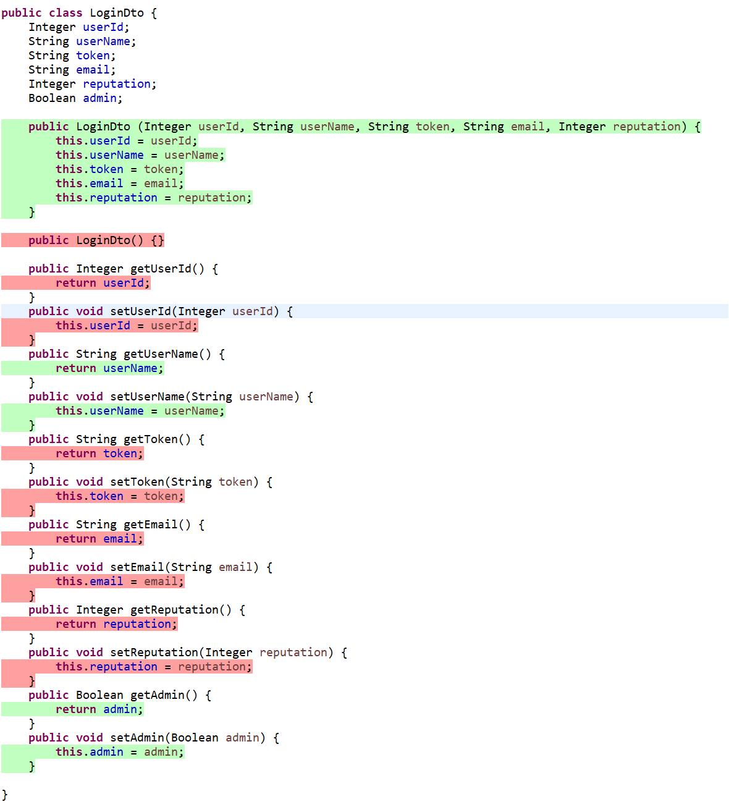
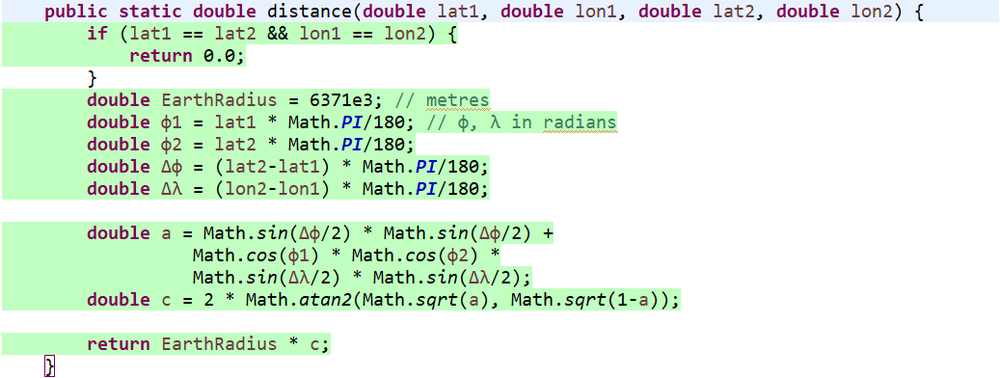

# Unit Testing Documentation

Authors:

Date:

Version:

# Contents

- [Black Box Unit Tests](#black-box-unit-tests)

- [White Box Unit Tests](#white-box-unit-tests)

# Black Box Unit Tests

    <Define here criteria, predicates and the combination of predicates for each function of each class.
    Define test cases to cover all equivalence classes and boundary conditions.
    In the table, report the description of the black box test case and (traceability) the correspondence with the JUnit test case writing the 
    class and method name that contains the test case>
    <JUnit test classes must be in src/test/java/it/polito/ezgas   You find here, and you can use,  class EZGasApplicationTests.java that is executed before 
    the set up of all Spring components
    >

 ### **Class *class_name* - method *name***

**Criteria for method *name*:**
	

 - 
 - 

**Predicates for method *name*:**

| Criteria | Predicate |
| -------- | --------- |
|          |           |
|          |           |
|          |           |
|          |           |

**Boundaries**:

| Criteria | Boundary values |
| -------- | --------------- |
|          |                 |
|          |                 |

**Combination of predicates**:

| Criteria 1 | Criteria 2 | ... | Valid / Invalid | Description of the test case | JUnit test case |
|-------|-------|-------|-------|-------|-------|
|||||||
|||||||
|||||||
|||||||
|||||||

# White Box Unit Tests

### Test cases definition
    
    <JUnit test classes must be in src/test/java/it/polito/ezgas>
    <Report here all the created JUnit test cases, and the units/classes under test >
    <For traceability write the class and method name that contains the test case>

| Unit name | JUnit test case |
|--|--|
|||
|||
||||

### Code coverage report

    <Add here the screenshot report of the statement and branch coverage obtained using
    the Eclemma tool. >

### Loop coverage analysis

    <Identify significant loops in the units and reports the test cases
    developed to cover zero, one or multiple iterations >

|Unit name | Loop rows | Number of iterations | JUnit test case |
|---|---|---|---|
|||||
|||||
||||||

 ### **Class *LoginDto* - *getUserName***

**Criteria for *getUserName*:**
	

 - Length of *userName* string

**Predicates for method *getUserName*:**

| Criteria | Predicate |
| -------- | --------- |
| Length of *userName* string       | >0          |
|          | =0          |
|          | null          |

**Boundaries**:

| Criteria | Boundary values |
| -------- | --------------- |
| Length of *userName* string         | ""                |
|          | null                |

**Combination of predicates**:

Predicates are incompatible, no combination possible

 ### **Class *LoginDto* - *setUserName***

**Criteria for *setUserName*:**
	

 - Length of *userName* string

**Predicates for method *setUserName*:**

| Criteria | Predicate |
| -------- | --------- |
| Length of *userName* string       | >0          |
|          | =0          |
|          | null          |

**Boundaries**:

| Criteria | Boundary values |
| -------- | --------------- |
| Length of *userName* string | "" |
|          | null |

**Combination of predicates**:

Predicates are incompatible, no combination possible

 ### **Class *LoginDto* - *getAdmin***

**Criteria for *getAdmin*:**
	

 - Value of *admin* boolean

**Predicates for method *getAdmin*:**

| Criteria | Predicate |
| -------- | --------- |
| Value of *admin* boolean       | Uninitialized          |
|          | After setAdmin(null)          |
|          | After setAdmin(false)          |
|          | After setAdmin(true)          |

**Boundaries**:

| Criteria | Boundary values |
| -------- | --------------- |
| Value of *admin* boolean | null |
|          | false |
|          | true |

**Combination of predicates**:

Predicates are incompatible, no combination possible

 ### **Class *GasStationServiceimpl* - *distance***

**Criteria for *distance*:**
	

 - Value of *lat1* double
 - Value of *lon1* double
 - Value of *lat2* double
 - Value of *lon2* double

**Predicates for method *distance*:**

| Criteria | Predicate |
| -------- | --------- |
| Value of *lat1* double       | Any value          |
| Value of *lon1* double       | Any value          |
| Value of *lat2* double       | Any value          |
| Value of *lon2* double       | Any value          |

**Boundaries**:

| Criteria | Boundary values |
| -------- | --------------- |
| Value of *lat1* double | (Double) null |
|          | MAX_VALUE |
|          | MAX_VALUE+1.0 |
|          | MIN_VALUE |
|          | MIN_VALUE-1.0 |
| Value of *lon1* double | (Double) null |
|          | MAX_VALUE |
|          | MAX_VALUE+1.0 |
|          | MIN_VALUE |
|          | MIN_VALUE-1.0 |
| Value of *lat2* double | (Double) null |
|          | MAX_VALUE |
|          | MAX_VALUE+1.0 |
|          | MIN_VALUE |
|          | MIN_VALUE-1.0 |
| Value of *lon2* double | (Double) null |
|          | MAX_VALUE |
|          | MAX_VALUE+1.0 |
|          | MIN_VALUE |
|          | MIN_VALUE-1.0 |
| Value of *lon2* double | (Double) null |
|          | MAX_VALUE |
|          | MAX_VALUE+1.0 |
|          | MIN_VALUE |
|          | MIN_VALUE-1.0 |

**Combination of predicates**:

| *lat1* | *lat2* | *lon1* | *lon2* | Valid / Invalid | Description of the test case | JUnit test case |
|-------|-------|-------|-------|-------|-------|-------|
|*lat1*|*lat1*|*lon1*|*lon1*|Valid|Returns 0.0|Returns 0.0|
|*lat1*|*lat1* + n * 360|*lon1*|*lon1* + n * 360|Valid|Returns 0.0|Returns 0.0|

# White Box Unit Tests

### Test cases definition
    
    <JUnit test classes must be in src/test/java/it/polito/ezgas>
    <Report here all the created JUnit test cases, and the units/classes under test >
    <For traceability write the class and method name that contains the test case>

| Unit name | JUnit test case |
|--|--|
|LoginDto.getUserName|testLoginDto1_1|
||testLoginDto1_2|
||testLoginDto1_3|
|LoginDto.setUserName|testLoginDto1_4|
||testLoginDto1_5|
||testLoginDto1_6|
|LoginDto.getAdmin|testLoginDto2_1|
||testLoginDto2_2|
||testLoginDto2_3|
||testLoginDto2_4|
|GasStationServiceimpl.distance|testGasStationServiceimpl1_1|
||testGasStationServiceimpl1_2|
||testGasStationServiceimpl1_3|
||testGasStationServiceimpl1_4|
||testGasStationServiceimpl1_5|
||testGasStationServiceimpl1_6|
||testGasStationServiceimpl1_7|
||testGasStationServiceimpl1_8|

### Code coverage report

    <Add here the screenshot report of the statement and branch coverage obtained using
    the Eclemma tool. >
LoginDto

GasStationServiceimpl.distance

### Loop coverage analysis

    <Identify significant loops in the units and reports the test cases
    developed to cover zero, one or multiple iterations >

|Unit name | Loop rows | Number of iterations | JUnit test case |
|---|---|---|---|
|||||
|||||
||||||

