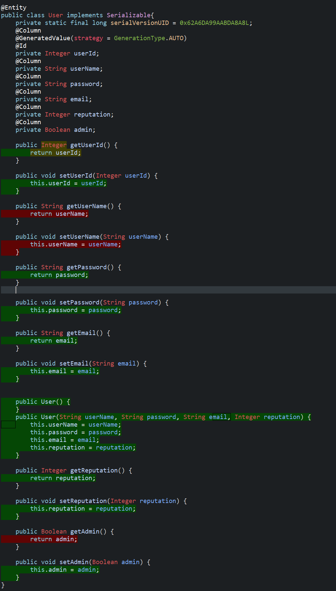

# Unit Testing Documentation

Authors:

Date:

Version:

# Contents

- [Black Box Unit Tests](#black-box-unit-tests)

- [White Box Unit Tests](#white-box-unit-tests)

# Black Box Unit Tests

    <Define here criteria, predicates and the combination of predicates for each function of each class.
    Define test cases to cover all equivalence classes and boundary conditions.
    In the table, report the description of the black box test case and (traceability) the correspondence with the JUnit test case writing the 
    class and method name that contains the test case>
    <JUnit test classes must be in src/test/java/it/polito/ezgas   You find here, and you can use,  class EZGasApplicationTests.java that is executed before 
    the set up of all Spring components
    >

### **Class *GasStation* - method *setGasStationId(Integer gasStationId)***

**Criteria for method *setGasStationId(Integer gasStationId)*:**
	
 - Range
 - Sign
  
  
**Predicates for method *setGasStationId(Integer gasStationId)*:**

| Criteria | Predicate |
| -------- | :---------: |
|  Range    |  gasStationId ≥ maxint    |
|           |  gasStationId ≤ minint    |
|           | minint ≤ gasStationId ≤ maxint    |
|  Sign     |  gasStationId > 0         |
|           |  gasStationId < 0         |

**Boundaries**:

| Criteria | Boundary values |
| -------- | :---------: |
|  Range    |  minint, maxint    |
|  Sign     |  0        |

**Combination of predicates**:

| Range|Sign| Valid / Invalid | Description of the test case | JUnit test case |
|:-------:|:-------:|:-------:|-------|-------|
|gasStationId ≥ maxint|gasStationId > 0 |Valid|setGasStationId(Integer.MAX_VALUE+1)-> Integer.MIN_VALUE| testGasStation1_1 |
||gasStationId < 0 |Invalid|-| |
|gasStationId ≤ maxint|gasStationId > 0 |Invalid|-| |
||gasStationId < 0 |Valid|setGasStationId(Integer.MIN_VALUE-1)-> Integer.MAX_VALUE| testGasStation1_2|
|minint ≤ gasStationId ≤ maxint|gasStationId > 0 |Valid|setGasStationId(4)-> 4| testGasStation1_3|
||gasStationId < 0 |Valid|setGasStationId(-4)-> -4| testGasStation1_4|

 
### **Class *GasStation* - method *getGasStationId()***

**Criteria for method *getGasStationId()*:**
	
 - gasStationId is null
  
**Predicates for method *getGasStationId()*:**

| Criteria | Predicate |
| -------- | :---------: |
| gasStationId is null    |  True    |
|                                |  False   |

**Boundaries**:

| Criteria | Boundary values |
| -------- | --------------- |

**Combination of predicates**:

| gasStationId is null| Valid / Invalid | Description of the test case | JUnit test case 
|:-------:|:-------:|-------|-------|
|True|Valid|getGasStationId()-> NULL| testGasStation1_5 |
|False|Valid|getGasStationId()-> 4| testGasStation1_3|

### **Class *GasStation* - method *setGasStationName(String gasStationName)***

**Criteria for method *setGasStationName(String gasStationName)*:**
	
 - String length
  
  
  
  
**Predicates for method *setGasStationName(String gasStationName)*:**

| Criteria | Predicate |
| -------- | :---------: |
|  String length    |  0 < s.length < s.maxlength   |
|           | s.length > s.maxlength  |

**Boundaries**:

| Criteria | Boundary values |
| -------- | :---------: |
|  String length| 0, s.maxlenght

**Combination of predicates**:

| Length| Valid / Invalid | Description of the test case | JUnit test case |
|:-------:|:-------:|:-------:|-------|
| 0 < s.length < s.maxlength  | Valid | setGasStationName("Agip") -> "Agip"|testGasStation1_6|
| s.length = 0  | Valid | setGasStationName("") -> ""|testGasStation1_7|

### **Class *GasStation* - method *getGasStationName()***

**Criteria for method *getGasStationName()*:**
	
 - gasStationName is null
  
**Predicates for method *getGasStationName()*:**

| Criteria | Predicate |
| -------- | :---------: |
| gasStationName is null    |  True    |
|                                |  False   |

**Boundaries**:

| Criteria | Boundary values |
| -------- | --------------- |

**Combination of predicates**:

| gasStationName is null| Valid / Invalid | Description of the test case | JUnit test case 
|:-------:|:-------:|-------|-------|
|True|Valid|getGasStationName()-> NULL|testGasStation1_8 |
|False|Valid|getGasStationName()-> "Agip"| testGasStation1_6|

### **Class *GasStation* - method *setReportDependability(double reportDependability)***

**Criteria for method *setReportDependability(double reportDependability)*:**
	
 - Range
 - Sign
  
  
**Predicates for method *setReportDependability(double reportDependability)*:**

| Criteria | Predicate |
| -------- | :---------: |
|  Range    |  reportDependability ≥ maxint    |
|           |  reportDependability ≤ minint    |
|           | minint ≤ reportDependability ≤ maxint    |
|  Sign     |  reportDependability > 0         |
|           |  reportDependability < 0         |

**Boundaries**:

| Criteria | Boundary values |
| -------- | :---------: |
|  Range    |  minint, maxint    |
|  Sign     |  0        |

**Combination of predicates**:

| Range|Sign| Valid / Invalid | Description of the test case | JUnit test case
|:-------:|:-------:|:-------:|-------|-------|
|reportDependability ≥ maxint|reportDependability > 0 |Valid|setReportDependability(Double.MAX_VALUE+1)-> Double.MAX_VALUE| testGasStation2_1|
||reportDependability < 0 |Invalid|-| |
|reportDependability ≤ minint|reportDependability > 0 |Invalid|-| |
|minint ≤ reportDependability ≤ maxint|reportDependability > 0 |Valid|setReportDependability(4.2)-> 4.2| testGasStation2_2|
||reportDependability < 0 |Valid|setReportDependability(-4.2)-> -4.2|testGasStation2_3 |

### **Class *GasStation* - method *getReportDependability()***

**Criteria for method *getReportDependability()*:**
	
 - ReportDependability is null
  
**Predicates for method *getReportDependability()*:**

| Criteria | Predicate |
| -------- | :---------: |
| ReportDependability is null    |  True    |
|                                |  False   |

**Boundaries**:

| Criteria | Boundary values |
| -------- | --------------- |

**Combination of predicates**:

| ReportDependability is null| Valid / Invalid | Description of the test case | JUnit test case 
|:-------:|:-------:|-------|-------|
|True|Valid|getReportDependability()-> NULL| testGasStation2_4 |
|False|Valid|getReportDependability()-> 4.2| testGasStation2_2 |

 ### **Class *GasStation* - method *getUserId()***

**Criteria for method *getUserId()*:**
	
 - userId is null
  
**Predicates for method *getUserId()*:**

| Criteria | Predicate |
| -------- | :---------: |
| userId is null    |  True    |
|                                |  False   |

**Boundaries**:

| Criteria | Boundary values |
| -------- | --------------- |

**Combination of predicates**:

| userId is null| Valid / Invalid | Description of the test case | JUnit test case 
|:-------:|:-------:|-------|-------|
|True|Valid|getUserId())-> NULL| testUser1_5|
|False|Valid|getUserId()-> 3| testUser1_3|

### **Class *User* - method *setUserId(Integer userId)***

**Criteria for method *setUserId(Integer userId)*:**
	
 - Range
 - Sign
  
  
**Predicates for method *setUserId(Integer userId)*:**

| Criteria | Predicate |
| -------- | :---------: |
|  Range    |  userId ≥ maxint    |
|           |  userId ≤ minint    |
|           | minint ≤ userId ≤ maxint    |
|  Sign     |  userId > 0         |
|           |  userId < 0         |

**Boundaries**:

| Criteria | Boundary values |
| -------- | :---------: |
|  Range    |  minint, maxint    |
|  Sign     |  0        |

**Combination of predicates**:

| Range|Sign| Valid / Invalid | Description of the test case | JUnit test case |
|:-------:|:-------:|:-------:|-------|-------|
|userId ≥ maxint|userId > 0 |Valid|setUserId(Integer.MAX_VALUE+1)-> Integer.MIN_VALUE| testUser1_1|
||userId < 0 |Invalid|-| |
|userId ≤ maxint|userId > 0 |Invalid|-| |
||userId < 0 |Valid|setUserId(Integer.MIN_VALUE-1)-> Integer.MAX_VALUE| testUser1_2|
|minint ≤ userId ≤ maxint|userId > 0 |Valid|setUserId(4)-> 4| testUser1_3|
||userId < 0 |Valid|setUserId(-4)-> -4| testUser1_4|

### **Class *User* - method *getPassword()***

**Criteria for method *getPassword()*:**
	
 - password is null
  
**Predicates for method *getPassword()*:**

| Criteria | Predicate |
| -------- | :---------: |
| password is null    |  True    |
|                                |  False   |

**Boundaries**:

| Criteria | Boundary values |
| -------- | --------------- |

**Combination of predicates**:

| password is null| Valid / Invalid | Description of the test case | JUnit test case 
|:-------:|:-------:|-------|-------|
|True|Valid|getPassword())-> NULL| testUser1_6|
|False|Valid|getPassword()-> "testpass"| testUser1_7|

 ### **Class *LoginDto* - *getUserName***

**Criteria for *getUserName*:**
	

 - Length of *userName* string

**Predicates for method *getUserName*:**

| Criteria | Predicate |
| -------- | --------- |
| Length of *userName* string       | >0          |

**Boundaries**:

| Criteria | Boundary values |
| -------- | --------------- |
| Length of *userName* string         | ""                |
|          | null                |

**Combination of predicates**:

| Length of *userName* string | Valid / Invalid | Description of the test case | JUnit test case |
|-------|-------|-------|-------|
|>0|Valid|Object initialized with "Mario Rossi"; getUserName() -> "Mario Rossi"|testLoginDto1_1()|
|=0|Valid|Object initialized with ""; getUserName() -> ""|testLoginDto1_2()|
|null|Valid|Object initialized with null; getUserName() -> null|testLoginDto1_3()|
|<0|Invalid|Object initialized with a string of negative length |Not feasible|
|>max array size|Invalid|Object initialized with a string of length > max array size|Not feasible|

 ### **Class *LoginDto* - *setUserName***

**Criteria for *setUserName*:**
	

 - Length of *userName* string

**Predicates for method *setUserName*:**

| Criteria | Predicate |
| -------- | --------- |
| Length of *userName* string       | >0          |

**Boundaries**:

| Criteria | Boundary values |
| -------- | --------------- |
| Length of *userName* string | "" |
|          | null |

**Combination of predicates**:

| Length of *userName* string | Valid / Invalid | Description of the test case | JUnit test case |
|-------|-------|-------|-------|
|>0|Valid|setUserName("Luigi Verdi"); getUserName() -> "Luigi Verdi"|testLoginDto1_4()|
|=0|Valid|setUserName(""); getUserName() -> ""|testLoginDto1_5()|
|null|Valid|setUserName(null); getUserName() -> null|testLoginDto1_6()|
|<0|Invalid|Not feasible |Not feasible|
|>max array size|Invalid|str = string of length > max array size|setUserName(str) -> java.lang.OutOfMemoryError: Requested array size exceeds VM limit|

 ### **Class *LoginDto* - *getAdmin***

**Criteria for *getAdmin*:**
	

 - Value of *admin* boolean

**Predicates for method *getAdmin*:**

| Criteria | Predicate |
| -------- | --------- |
| Value of *admin* boolean       | Uninitialized          |
|          | After setAdmin(null)          |
|          | After setAdmin(false)          |
|          | After setAdmin(true)          |

**Boundaries**:

| Criteria | Boundary values |
| -------- | --------------- |
| Value of *admin* boolean | null |
|          | false |
|          | true |

**Combination of predicates**:

| Value of *admin* boolean | Valid / Invalid | Description of the test case | JUnit test case |
|-------|-------|-------|-------|
|Uninitialized|Valid| getAdmin() -> false|testLoginDto2_1()|
|false|Valid| setAdmin(null); getAdmin() -> null | testLoginDto2_2()|
|false|Valid| setAdmin(false); getAdmin() -> false | testLoginDto2_3()|
|false|Valid| setAdmin(true); getAdmin() -> true | testLoginDto2_4()|

 ### **Class *GasStationServiceimpl* - *distance***

**Criteria for *distance*:**
	

 - Value of *lat1* double
 - Value of *lon1* double
 - Value of *lat2* double
 - Value of *lon2* double

**Predicates for method *distance*:**

| Criteria | Predicate |
| -------- | --------- |
| Value of *lat1* double       | Any value          |
| Value of *lon1* double       | Any value          |
| Value of *lat2* double       | Any value          |
| Value of *lon2* double       | Any value          |

**Boundaries**:

| Criteria | Boundary values |
| -------- | --------------- |
| Value of *lat1* double | (Double) null |
|          | MAX_VALUE |
|          | MAX_VALUE+1.0 |
|          | MIN_VALUE |
|          | MIN_VALUE-1.0 |
| Value of *lon1* double | (Double) null |
|          | MAX_VALUE |
|          | MAX_VALUE+1.0 |
|          | MIN_VALUE |
|          | MIN_VALUE-1.0 |
| Value of *lat2* double | (Double) null |
|          | MAX_VALUE |
|          | MAX_VALUE+1.0 |
|          | MIN_VALUE |
|          | MIN_VALUE-1.0 |
| Value of *lon2* double | (Double) null |
|          | MAX_VALUE |
|          | MAX_VALUE+1.0 |
|          | MIN_VALUE |
|          | MIN_VALUE-1.0 |
| Value of *lon2* double | (Double) null |
|          | MAX_VALUE |
|          | MAX_VALUE+1.0 |
|          | MIN_VALUE |
|          | MIN_VALUE-1.0 |

**Combination of predicates**:

| *lat1* | *lat2* | *lon1* | *lon2* | Valid / Invalid | Description of the test case | JUnit test case |
|-------|-------|-------|-------|-------|-------|-------|
|*lat1*|*lat1*|*lon1*|*lon1*|Valid|distance(0.0, 0.0, 0.0, 0.0) -> 0.0|testGasStationServiceimpl1_1()|
|*lat1*|*lat1* + n * 360|*lon1*|*lon1* + n * 360|Valid|distance(0.0, 180.0, 0.0, -180.0) -> 0.0|testGasStationServiceimpl1_2()|
|*lat1*|!=*lat1* + n * 360|*lon1*|!=*lon1* + n * 360|Valid|distance(0.0, 1.0, 0.0, 0.0) -> !=0.0|testGasStationServiceimpl1_3()|

### **Class *UserDto* - *getEmail()***

**Criteria for *getEmail()*:**

 - Length of *email* string

**Predicates for method *getEmail()*:**

| Criteria | Predicate |
| -------- | --------- |
| Length of *email* string       | >0          |

**Boundaries**:

| Criteria | Boundary values |
| -------- | --------------- |
| Length of *email* string         | ""                |
|          | null                |

**Combination of predicates**:

| Length of *email* string | Valid / Invalid | Description of the test case | JUnit test case |
|-------|-------|-------|-------|
|>0|Valid|Object initialized with "mario.rossi@polito.it"; getEmail() -> "mario.rossi@polito.it"|testUserDto1_1()|
|=0|Valid|Object initialized with ""; getEmail() -> ""|testUserDto1_2()|
|null|Valid|Object initialized with null; getEmail() -> null|testUserDto1_3()|
|<0|Invalid|Object initialized with a string of negative length |Not feasible|
|>max array size|Invalid|Object initialized with a string of length > max array size|Not feasible|

 ### **Class *UserDto* - *setEmail(String email)***

**Criteria for *setEmail(String email)*:**

 - Length of *email* string

**Predicates for method *setEmail(String email)*:**

| Criteria | Predicate |
| -------- | --------- |
| Length of *email* string       | >0          |

**Boundaries**:

| Criteria | Boundary values |
| -------- | --------------- |
| Length of *email* string | "" |
|          | null |

**Combination of predicates**:

| Length of *email* string | Valid / Invalid | Description of the test case | JUnit test case |
|-------|-------|-------|-------|
|>0|Valid|setEmail("luigi.verdi@polito.it"); getEmail() -> "luigi.verdi@polito.it"|testUserDto1_4()|
|=0|Valid|setEmail(""); getEmail() -> ""|testUserDto1_5()|
|null|Valid|setEmail(null); getEmail() -> null|testUserDto1_6()|
|<0|Invalid|Not feasible |Not feasible|
|>max array size|Invalid|str = string of length > max array size|setEmail(str) -> java.lang.OutOfMemoryError: Requested array size exceeds VM limit|

 
 ### **Class *UserDto* - method *getReputation()***

**Criteria for method *getReputation()*:**

 - reputation is null
  
**Predicates for method *getReputation()*:**

| Criteria | Predicate |
| -------- | :---------: |
| reputation is null    |  True    |
|                       |  False   |

**Boundaries**:

| Criteria | Boundary values |
| -------- | --------------- |

**Combination of predicates**:

| reputation is null| Valid / Invalid | Description of the test case | JUnit test case 
|:-------:|:-------:|-------|-------|
|True|Valid|getReputation()-> NULL| testGasStation2_1 |
|False|Valid|getReputation()-> 1| testGasStation2_2|

### **Class *UserDto* - method *setReputation(Integer reputation)***

**Criteria for method *setReputation(Integer reputation)*:**

   - Range
   - Sign
  
**Predicates for method *setReputation(Integer reputation)*:**

| Criteria | Predicate |
| -------- | :---------: |
| Range    |  reputation < -5    |
|                                |  -5 <= reputation <= 5   |
|                                |  reputation > 5   |
| Sign    |  reputation > 0    |
|                                |  reputation < 0   |

**Boundaries**:

| Criteria | Boundary values |
| -------- | :---------: |
|  Range    |  -5, 5    |
|  Sign     |  0        |

**Combination of predicates**:

| Range|Sign| Valid / Invalid | Description of the test case | JUnit test case |
|:-------:|:-------:|:-------:|-------|-------|
|reputation ≥ 5|reputation > 0 |Valid|setReputation(5+1)| testUserDto2_3 |
||reputation < 0 |Invalid|-| |
|reputation ≤ -5|reputation > 0 |Invalid|-| |
||reputation < 0 |Valid|setReputation(-5-1)| testUserDto2_4|
|-5 ≤ reputation ≤ 5|reputation > 0 |Valid|setReputation(1) -> 1| testUserDto2_2|
||reputation < 0 |Valid|setReputation(-1)-> -1| testUserDto2_5|

 ### **Class *IdPw* - method *getUser()***

**Criteria for method *getUser()*:**
	
 - User is null
  
**Predicates for method *getUser()*:**

| Criteria | Predicate |
| -------- | :---------: |
| User is null    |  True    |
|                                |  False   |

**Boundaries**:

| Criteria | Boundary values |
| -------- | --------------- |

**Combination of predicates**:

| User is null| Valid / Invalid | Description of the test case | JUnit test case 
|:-------:|:-------:|-------|-------|
|True|Valid|getUser())-> NULL| testIdPw1_1|
|False|Valid|getUser()-> "testuser"| testIdPw1_4|

### **Class *IdPw* - method *setUser(String user)***

**Criteria for *setUser(String user)*:**

 - Length of *user* string

**Predicates for method *setUser(String user)*:**

| Criteria | Predicate |
| -------- | --------- |
| Length of *user* string       | >0          |

**Boundaries**:

| Criteria | Boundary values |
| -------- | --------------- |
| Length of *user* string | "" |
|          | null |

**Combination of predicates**:

| Length of *user* string | Valid / Invalid | Description of the test case | JUnit test case |
|-------|-------|-------|-------|
|>0|Valid|setUser("testuser"); getUser() -> "testuser"|testIdPw1_4()|
|=0|Valid|setUser(""); getUser() -> ""|testIdPw1_5()|
|null|Valid|setUser(null); getUser() -> null|testIdPw1_6()|
|<0|Invalid|Not feasible |Not feasible|
|>max array size|Invalid|str = string of length > max array size|setUser(str) -> java.lang.OutOfMemoryError: Requested array size exceeds VM limit|

### **Class *IdPw* - method *getPw()***

**Criteria for method *getPw()*:**
	
 - password is null
  
**Predicates for method *getPw()*:**

| Criteria | Predicate |
| -------- | :---------: |
| password is null    |  True    |
|                                |  False   |

**Boundaries**:

| Criteria | Boundary values |
| -------- | --------------- |

**Combination of predicates**:

| password is null| Valid / Invalid | Description of the test case | JUnit test case 
|:-------:|:-------:|-------|-------|
|True|Valid|getPw())-> NULL| testIdPw1_2|
|False|Valid|getPw()-> "testpass"| testIdPw1_3|

### **Class *IdPw* - method *setPw(String pw)***

**Criteria for *setPw(String pw)*:**

 - Length of *pw* string

**Predicates for method *setPw(String pw)*:**

| Criteria | Predicate |
| -------- | --------- |
| Length of *pw* string       | >0          |

**Boundaries**:

| Criteria | Boundary values |
| -------- | --------------- |
| Length of *pw* string | "" |
|          | null |

**Combination of predicates**:

| Length of *pw* string | Valid / Invalid | Description of the test case | JUnit test case |
|-------|-------|-------|-------|
|>0|Valid|setPw("testpass"); getPw() -> "testpass"|testIdPw1_3()|
|=0|Valid|setPw(""); getPw() -> ""|testIdPw1_7()|
|null|Valid|setPw(null); getPw() -> null|testIdPw1_8()|
|<0|Invalid|Not feasible |Not feasible|
|>max array size|Invalid|str = string of length > max array size|setPw(str) -> java.lang.OutOfMemoryError: Requested array size exceeds VM limit|

# White Box Unit Tests

### Test cases definition
    
    <JUnit test classes must be in src/test/java/it/polito/ezgas>
    <Report here all the created JUnit test cases, and the units/classes under test >
    <For traceability write the class and method name that contains the test case>

| Unit name | JUnit test case |
|--|--|
|UserDto.getReputation|testGasStation2_1|
||testGasStation2_2|
|UserDto.setReputation|testGasStation2_3|
||testGasStation2_4|
||testGasStation2_5|
|UserDto.getEmail|testUserDto1_1|
||testUserDto1_2|
||testUserDto1_3|
|UserDto.setEmail|testUserDto1_4|
||testUserDto1_5|
||testUserDto1_6|
|LoginDto.getUserName|testLoginDto1_1|
||testLoginDto1_2|
||testLoginDto1_3|
|LoginDto.setUserName|testLoginDto1_4|
||testLoginDto1_5|
||testLoginDto1_6|
|LoginDto.getAdmin|testLoginDto2_1|
||testLoginDto2_2|
||testLoginDto2_3|
||testLoginDto2_4|
|GasStationServiceimpl.distance|testGasStationServiceimpl1_1|
||testGasStationServiceimpl1_2|
||testGasStationServiceimpl1_3|
||testGasStationServiceimpl1_4|
||testGasStationServiceimpl1_5|
||testGasStationServiceimpl1_6|
||testGasStationServiceimpl1_7|
||testGasStationServiceimpl1_8|
|GasStation.setGasStationId| testGasStation1_1|
||testGasStation1_2|
||testGasStation1_3|
||testGasStation1_4|
|GasStation.getGasStationId|testGasStation1_5|
||testGasStation1_3|
|GasStation.setGasStationName| testGasStation1_6|
||testGasStation1_7|
|GasStation.getGasStationName|testGasStation1_8|
|| testGasStation1_6|
|GasStation.setReportDependeability| testGasStation2_1|
||testGasStation2_2|
||testGasStation2_3|
|GasStation.getReportDependeability|testGasStation2_4|
||testGasStation2_2|
|User.setUserId|testUser1_1|
||testUser1_2|
||testUser1_3|
||testUser1_4|
|User.getUserId|testUser1_5|
||testUser1_3|
|User.getPassword|testUser1_6|
||testUser1_7|
|IdPw.getUser|testUser1_1|
||testUser1_4|
||testUser1_5
||testUser1_6|
|IdPw.getPw|testUser1_2|
||testUser1_3|
||testUser1_7|
||testUser1_8|

### Code coverage report

    <Add here the screenshot report of the statement and branch coverage obtained using
    the Eclemma tool. >
UserDto

LoginDto

GasStationServiceimpl.distance

GasStation 

User 

### Loop coverage analysis

    <Identify significant loops in the units and reports the test cases
    developed to cover zero, one or multiple iterations >

|Unit name | Loop rows | Number of iterations | JUnit test case |
|---|---|---|---|
|||||
|||||
||||||

